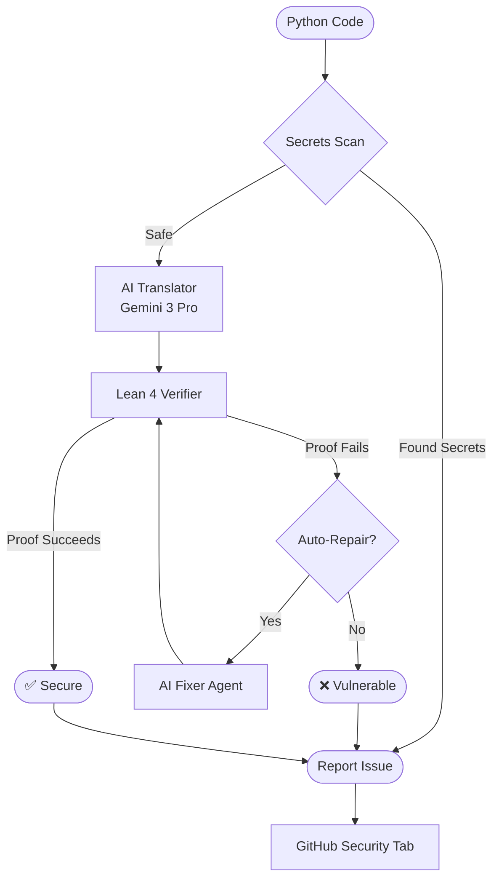

# Argus 🛡️

## Neuro-Symbolic AI Security Auditor

**Mathematically Verified Code Repair Powered by Gemini 3 Pro + Lean 4**

[](https://github.com/Platinum3nx/Argus)
[](https://ai.google.dev/)
[](https://leanprover.github.io/)
[](https://dafny.org/)

Argus is a **zero-config GitHub Action** that combines the creativity of **Gemini** with the rigor of **Lean 4 formal proofs** to automatically find AND fix security vulnerabilities in Python code.

> **100% Reliable** — Not because we avoid AI, but because every AI-generated fix is **mathematically verified** before being accepted.

---

## ✨ Key Features

| Feature | Description |
|---------|-------------|
| 🔄 **Neuro-Symbolic Repair** | AI proposes fixes, Math verifies them |
| 🔐 **Secrets Detection** | Catches 15+ types of leaked credentials |
| 📊 **Rich Reports** | Counterexample tables + "Why Vulnerable?" explanations |
| 🤖 **Auto-Remediation PRs** | Verified fixes submitted automatically |
| 📈 **GitHub Security Tab** | SARIF integration for Code Scanning |
| 🎯 **Zero Config** | Just add the workflow file and go |

---

## 🔄 How It Works



**The key insight: AI proposes, Math verifies.** Gemini generates fixes, while **Lean 4** (for logic) and **Dafny** (for loops) prove they're correct.

---

## 🚀 Quick Start

### 1. Add the GitHub Action

Create `.github/workflows/argus_audit.yml`:

```yaml
name: Argus Security Audit

on:
  push:
    branches: ['**']
  pull_request:
    branches: ['**']

permissions:
  contents: write
  pull-requests: write
  security-events: write

jobs:
  argus-check:
    runs-on: ubuntu-latest
    steps:
      - uses: actions/checkout@v4
        with:
          fetch-depth: 0
      
      - name: Run Argus AI Auditor
        uses: Platinum3nx/Argus@main
        with:
          gemini_api_key: ${{ secrets.GEMINI_API_KEY }}
        env:
          GITHUB_TOKEN: ${{ secrets.GITHUB_TOKEN }}
          GEMINI_API_KEY: ${{ secrets.GEMINI_API_KEY }}

      - name: Upload SARIF file
        uses: github/codeql-action/upload-sarif@v3
        if: always()
        with:
          sarif_file: argus_results.sarif
```

### 2. Add your Gemini API Key

1. Go to your repo → **Settings** → **Secrets and variables** → **Actions**
2. Add a new secret: `GEMINI_API_KEY`
3. Get your key from [Google AI Studio](https://aistudio.google.com/apikey)

### 3. Push code and see results!

Argus will automatically audit, fix, and open PRs with verified fixes.

---

## 📊 What You'll See

### GitHub Actions Summary

When Argus finds vulnerabilities, you'll see a rich report in the Actions Summary:

```markdown
# Argus AI Audit Report

## Summary
- **Total Files Audited:** 3
- **✅ Secure:** 1
- **🔧 Auto-Patched:** 1
- **❌ Vulnerable:** 1

---

### ❌ credit_system.py
**Status:** VULNERABLE

#### ⚠️ Why is this Vulnerable?
> The new balance calculation can exceed the credit limit, allowing unauthorized overspending.

**Counterexample Found:**
| Variable | Value |
|----------|-------|
| `balance` | 900 |
| `charge` | 200 |
| `limit` | 1000 |

<details><summary>View Formal Proof (Lean 4)</summary>

```lean
theorem charge_safe : ∀ balance charge limit,
  balance + charge ≤ limit := by
  sorry -- Proof failed: 900 + 200 = 1100 > 1000
```
</details>
```

### GitHub Security Tab

SARIF integration means findings appear in your repo's **Security** tab:

- Click **Security** → **Code scanning alerts**
- See vulnerability locations with line numbers
- Track remediation progress

---

## 🔧 Configuration

### .argusignore

Exclude files from auditing (works like `.gitignore`):

```text
# Ignore legacy modules
legacy_module/
old_script.py

# Ignore tests
tests/
*_test.py

# Ignore generated code
generated/
*.gen.py
```

---

## 🤖 Gemini Integration

Argus uses Gemini for three key tasks:

### 1. Code Translation
Translates Python to Lean 4 while preserving semantics and extracting invariants.

### 2. Intelligent Repair
When verification fails, Gemini understands the Lean error and generates a fix:

```
Lean Error: "omega could not prove: balance + amount ≤ limit"
     ↓
Gemini: "Add a guard: if balance + amount > limit, reject the charge."
```

### 3. Plain-English Explanations
The `/explain` API endpoint translates cryptic proofs into developer-friendly explanations.

---

## 🏗️ Architecture

| Component | File | Purpose |
|-----------|------|---------|
| **CI Runner** | `ci_runner.py` | Orchestrates audit + repair loop |
| **Lean Driver** | `lean_driver.py` | Runs Lean compiler, detects failures |
| **Dafny Driver** | `dafny_driver.py` | Verifies loop invariants & arrays |
| **AI Repair** | `ai_repair.py` | Gemini-powered code fixes |
| **Secrets Scanner** | `secrets_scanner.py` | Detects 15+ credential types |
| **SARIF Generator** | `sarif_generator.py` | GitHub Code Scanning output |
| **Explain API** | `main.py:/explain` | Gemini-powered error explanations |

---

## 🔐 Secrets Detection

Detected secret types:

| Type | Pattern |
|------|---------|
| AWS Access Key | `AKIA...` |
| Google API Key | `AIza...` |
| OpenAI API Key | `sk-...` |
| GitHub Token | `ghp_...`, `gho_...` |
| Stripe Key | `sk_live_...` |
| Database URLs | `postgres://...`, `mysql://...` |
| Generic High-Entropy | Any 32+ char random string |

---

## 🔒 Why It's Reliable

| Step | Tool | Can Hallucinate? |
|------|------|------------------|
| Translation | Deterministic AST | No |
| Verification | Lean 4 | No |
| Repair | Gemini | **Yes** |
| Re-Verification | Lean 4 | No (catches hallucinations) |

**If Gemini's fix is wrong, Lean 4 rejects it.** No hallucination can pass the prover.

---

## 📁 Demo Files

Test with files in `demo_files/`:

| File | Bug | Expected Result |
|------|-----|----------------|
| `wallet_buggy.py` | Missing balance check | AUTO_PATCHED |
| `wallet_secure.py` | None | SECURE |
| `credit_system.py` | Missing limit check | VULNERABLE/AUTO_PATCHED |
| `portfolioAggregate.py` | None (Loop Logic) | SECURE (Dafny) |
| `savingsAccount.py` | Variable Shadowing | AUTO_PATCHED |
| `config_with_secrets.py` | Hardcoded API keys | SECRET_DETECTED |

---

## 🛠️ Tech Stack

- **Python 3.11** — Backend and AST parsing
- **Lean 4.26.0** + **Mathlib** — Formal verification
- **Dafny 4.4.0** — Loop invariant verification
- **Gemini 3 Pro** — AI translation and repair
- **Next.js 14** — Frontend dashboard
- **Docker** — Containerized GitHub Action
- **SARIF 2.1.0** — Security report format

---

## 📜 License

MIT License — see [LICENSE](LICENSE) for details.

---

## 🏆 Built for the 2026 Gemini API Developer Competition

*"AI proposes, Math verifies."*

**Team:** Platinum3nx
